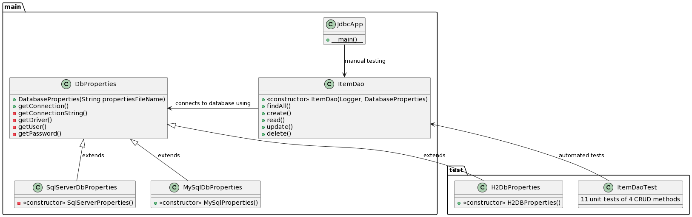
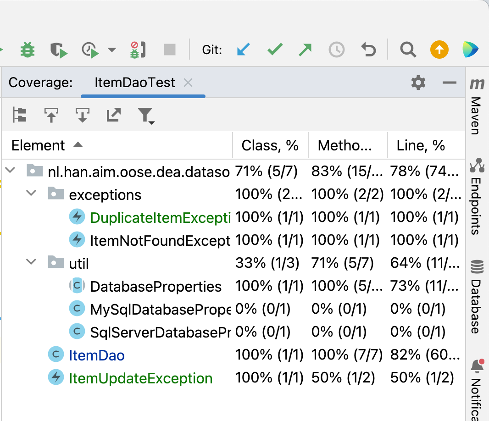

# Introductie

Deze workshop is deel van de DEA Course aan de Hogeschool Arnhem/Nijmegen. 
Onderwerp is het bekend raken met JDBC en de datasource-laag.

## Solution multi-database



In deze Git branch `solution-sqlserver` is uitwerking voor meerdere databases: zowel MySql als Sql Server. Als 3e is er nog H2 in memory database voor unit tests van DAO laag - wat eigenlijk intergratie tests zijn want de database is dus niet gemockt'.

In de `JdbcApp` met de `main` methode zit een boolean `useSqlServer`. Dit is geïmplementeerd met abstracte `DatabaseProperties` klasse met 3 specifiekere implementaties. Hieronder 

```mermaid
classDiagram
    ItemDao --> DbProperties: connects to database using
    DbProperties <|-- SqlServerDbProperties
    DbProperties <|-- MySqlDbProperties
    DbProperties <|-- H2DbProperties
    class DbProperties {
      +DatabaseProperties(String propertiesFileName)
      +getConnection()
      +getConnectionString()
      +getDriver()
      +getUser()
      +getPassword()
    }
    class SqlServerDbProperties {
      «constructor» -SqlServerProperties()
    }
    class MySqlDbProperties{
      «constructor» +MySqlProperties()
    }
    class H2DbProperties {
      «constructor» -SqlServerProperties()
    }
    class ItemDao {
        «constructor» +ItemDao(Logger, DatabaseProperties)
        +findAll()
        +create()
        +read()
        +update()
        +delete()
    }
 ```

### JUnit Tests en code Coverage



*Figuur 1*: Code coverage statistieken feb 2024.

Er zijn 11 JUnit tests, allen voor de 'hoofdklasse' `ItemDAO`. De *code coverage* is richting de 100% (zie figuur 1). De (bij BP verplichte) 80% overall line coverage haalt de test suite, met name omdat er in deze kleine code base relatief veel code staat in de de `main` methode in `JdbcApp`. 

Alleen de `MySQL..` en `SQLServerDatabaseProperties` staan niet onder test. Deze static methode unit testen is lastig, dan zou je bv. `System.out.println` of diens abstractielaag `Logger` moeten mocken o.i.d., wat een beetje overkill is. Vooral gezien de code in de `main` feitelijk al een soort (handmatige) test is.

### Databases runnen in Docker

Runnen SQL Server op Mac M2

```console
Source: https://learn.microsoft.com/en-us/sql/linux/quickstart-install-connect-docker?view=sql-server-ver16&tabs=cli&pivots=cs1-bash
docker run -e 'ACCEPT_EULA=Y' -e 'SA_PASSWORD=AJO1FEhsBxWL' -p 1433:1433 --name sqlserver --platform linux/amd64 -d mcr.microsoft.com/mssql/server:2019-latest
```

Runnen MySQL en adminer db admin webapp op poort 8080 kan door de `docker-compose.yml` te gebruiken:

```console
docker compose up
```

## Oefening

In deze oefening zal een stand-alone Java applicatie worden gemaakt, die in staat is om
een `Item` in een relationele database op te slaan, gebruikmakend van JDBC.
We zullen hierbij uitgaan van een MySql database (zorg voor de [community versie](https://dev.mysql.com/downloads/)).

**In deze oefening leer je:**

* Hoe je een properties-bestand kunt gebruiken en deze kunt laden van het Class-path
* Hoe je middels de JDBC-API een verbinding kunt leggen met een relationele database
* Hoe je een JDBC driver moet toevoegen aan een Maven Project
* Hoe je SQL kunt uitvoeren en de resultset kunt verwerken
* Hoe je het *Data Access Object* pattern kunt implementeren net JDBC

## 1: Toevoegen Database properties-bestand

Voeg een properties-bestand toe genaamd `database.properties` en plaats dit bestand in *src/main/resources*.
Voeg properties en waarden toe voor
* driver: bijvoorbeeld *com.mysql.cj.jdbc.Driver*
* connectionstring: bijvoorbeeld *jdbc:mysql://localhost:3306/items?serverTimezone=UTC&user=YOUR_USERNAME_HERE&password=YOUR_PASSWORD&useSSL=false*

## 2: Laden van de properties

Maak een nieuwe klasse `DatabaseProperties` in de package `nl.han.aim.oose.dea.datasource.util` die 
het properties-bestand kan laden en de waarden via get-methodes beschikbaar maakt.

## 3: Toevoegen van een main-methode

Maak een nieuwe klasse `JdbcApp` met een `main`-methode en test daarmee de `DatabaseProperties` klasse.

## 4: Aanmaken database

Maak een lege database aan en zorg ervoor dat de geconfigueerde gebruiker de juiste rechten heeft.

## 5: Toevoegen database-driver

Om via JDBC met de database te kunnen verbinden moet er een database-specifieke JDBC-driver worden geladen.
Voordat deze beschikbaar is moet er eerst een dependency aan de `pom.xml` worden toegevoegd:

  ```
	<dependency>
		<groupId>mysql</groupId>
		<artifactId>mysql-connector-java</artifactId>
		<version>8.0.29</version>
	</dependency>
   ```
## 6: Aanmaken Data Access Object

Maak een nieuwe klasse genaamd `ItemDao` met een methode genaamd `findAll()` die een `List<Item>`
teruggeeft. Plaats deze klasse in de package `nl.han.aim.oose.dea.datasource` en implementeer de `findAll`
methode:

* Gebruik `Class.forName` om de database driver te laden
* Gebruik `DriverManager.getConnection()` voor het maken van een `Connection`
* Via de `Connection` kan een `Statement` gemaakt worden `connection.prepareStatement("SELECT * FROM items").executeQuery();`
* Het uitvoeren van een `Statement` geeft een `ResultSet` terug
* Je kunt door een `ResultSet` heenloopen door `next()` te gebruiken

Gebruik de `main()` methode voor het aanroepen van de findAll() methode.

	Call the <code>findAll()</code> method from your main-method and display the results.

## 7: Toevoegen Logging

Tot nu toe heb je mogelijk excepties als volgt opgevangen:

```java
	  try
	  {
	      connection.prepareStatement("...").execute();
	      connection.close();
	  } catch (SQLException e) {
	      e.printStackTrace();
	  }
```

Zoals je mogelijk weet worden de stacktrace uitgeprint via `System.out`, die omgeleid kan worden.
Daarom heeft het de voorkeur een Logger te gebruiken.

Maak een Logger in je klasse en gebruik `Logger.log()` (of bijvoorbeeld `Logger.warning()`) voor het actief
loggen van fouten

## 8: Afmaken DAO

Implementeer 4 CRUD methodes voor de `ItemDao` (create, read (vind single item), update and delete) en maak daarbij gebruik van
`PreparedStatements`. Mogelijk heb je hierbij [Transactions](http://www.mkyong.com/jdbc/jdbc-transaction-example/) 
nodig.

## Bronnen

Object Management Group. (2017). Unified Modeling Language (UML), Version 2.5.1. https://www.omg.org/spec/UML/2.5.1