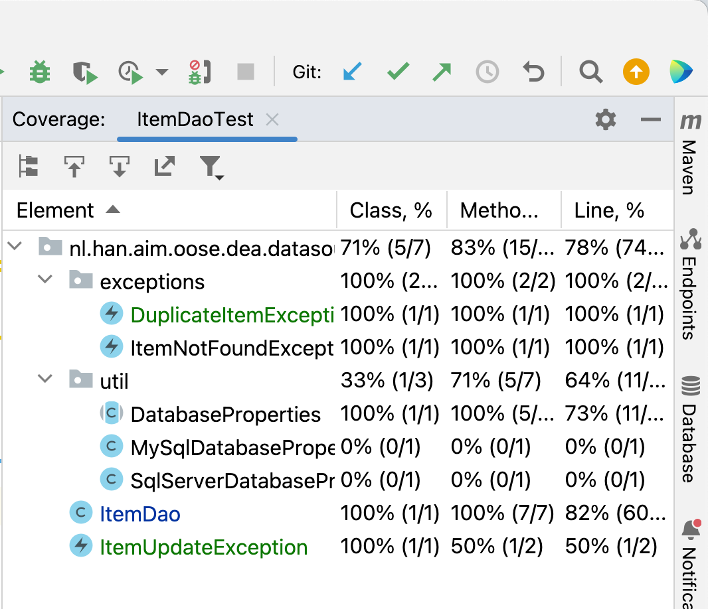
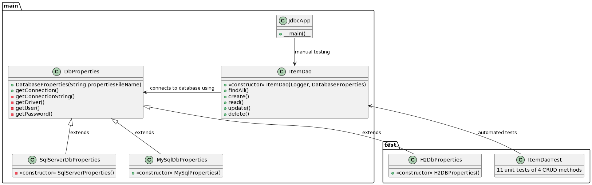

# Solution Sql Server / multi-database

In deze Git branch `solution-sqlserver` de uitwerking voor SQL Server, naast de standaard MySql oplossing. MySQL geeft minder issue omdat community driver meer bijgehouden wordt, en standaard security settings wat lager staan. Maar omdat je in course DB en/of semester ISE SQL Server gebruikt is dit toch wel prettig.

Feitelijk is deze oplossing ook direct voor meerdere databases: zowel MySql als Sql Server. En als 3e is er nog H2 in memory database voor unit tests van DAO laag - wat eigenlijk integratie tests zijn want de database is dus niet gemockt'. Dit document geeft een toelichting hierop, en is ook te zien als een voorbeeld van een opleverdocument, zoals je voor de [programmeeropdracht](https://github.com/hanica-dea/spotitube) 
moet schrijven (het 'Spotitube' BeroepsProduct (BP)).

Hieronder een uitleg van gebruik meerdere DBProperties bestanden en bijbehorende rassenhiërarchie. Daarna ook iets over de geschreven unit/integratie tests en code coverage hiervan.

## Multi database oplossing via db properties en klassenhierarchie

In de `JdbcApp` met de `main` methode zit een boolean `useSqlServer`, die standaard op `true` staat (als je op `false` zet gebruikt hij MySQL). Dit is een soort *feature toggle*, die je idealiter naar bv. aparte `application.properties` zou kunnen omzetten, i.p.v. hardcoded zoals nu. Maar voor een echte implementatie is dit ook wat overkill, omdat je in de praktijk 1 database (tegelijkertijd) ondersteunt vanwege het KISS-principe (Keep It Stupid Simple).

De implementatie gebruikt een abstracte `DatabaseProperties` klasse met 3 specifiekere implementaties; zie het (Mermaid) klasse diagram ~~hieronder~~ in Figuur 1.


*Figuur 1*: DBProperties klassenhiërarchie (klassendiagram)

```mermaid
classDiagram
    ItemDao --> DbProperties: connects to database using
    DbProperties <|-- SqlServerDbProperties
    DbProperties <|-- MySqlDbProperties
    DbProperties <|-- H2DbProperties
    class DbProperties {
      +DatabaseProperties(String propertiesFileName)
      +getConnection()
      +getConnectionString()
      +getDriver()
      +getUser()
      +getPassword()
    }
    class SqlServerDbProperties {
      «constructor» -SqlServerProperties()
    }
    class MySqlDbProperties{
      «constructor» +MySqlProperties()
    }
    class H2DbProperties {
      «constructor» -SqlServerProperties()
    }
    class ItemDao {
        «constructor» +ItemDao(Logger, DatabaseProperties)
        +findAll()
        +create()
        +read()
        +update()
        +delete()
    }
 ```

### JUnit Tests en code Coverage



*Figuur 1*: Code coverage statistieken feb 2024.

Er zijn 11 JUnit tests, allen voor de 'hoofdklasse' `ItemDAO`. De *code coverage* is richting de 100% (zie figuur 1). De (bij BP verplichte) 80% overall line coverage haalt de test suite, met name omdat er in deze kleine code base relatief veel code staat in de de `main` methode in `JdbcApp`. 

Alleen de `MySQL..` en `SQLServerDatabaseProperties` staan niet onder test. Deze static methode unit testen is lastig, dan zou je bv. `System.out.println` of diens abstractielaag `Logger` moeten mocken o.i.d., wat een beetje overkill is. Vooral gezien de code in de `main` feitelijk al een soort (handmatige) test is.

Onderstaand een package diagram die high level de packages `main` en `test`. Deze geeft ook aan dat de Junit dependency alleen tijdens testen beschikbaar is (aangegeven met de `<scope>test</scope>` voor deze dependency in de `pom.xml`). In werkelijkheid zijn de Java olders voor main en test `src/main/java` en `src/test/java`, volgens de standaard Maven conventie (Apache Maven Project, z.d.).




### Databases runnen in Docker

In plaats van de database native te installeren en te runnen, is een moderne aanpak ook je DB Server te runnen in een Docker container te runnen. Zoals je wellicht weet uit WebTech course. Voordeel is dat je evt. versie van een DB server makkelijk kan aanpassen en ook gelijk kunt trekken met gebruikte versie op productieomgeving voor meer 'dev/prod parity'. Hiermee los je het 'works on my machine' probleem op. Nadeel is natuurlijk dat je Docker moet installeren en hier enige kennis van moet hebben. Maar idealiter werken onderstaande commando's gewoon.

Onderstaande is gemaakt op/getest voor een MacBook met een M2 chip. Op een mac is SQL Server nog vrij lastig. Maar soortgelijke aanpak zou ook werken op een Window machine. Je moet dan wel Docker Desktop geinstalleerd hebben.

```console
Source: https://learn.microsoft.com/en-us/sql/linux/quickstart-install-connect-docker?view=sql-server-ver16&tabs=cli&pivots=cs1-bash
docker run -e 'ACCEPT_EULA=Y' -e 'SA_PASSWORD=AJO1FEhsBxWL' -p 1433:1433 --name sqlserver --platform linux/amd64 -d mcr.microsoft.com/mssql/server:2019-latest
```

Runnen MySQL en adminer db admin webapp op poort 8080 kan door de `docker-compose.yml` te gebruiken:

```console
docker compose up
```

Merk op dat deze Docker commando's GEEN [Docker volume](https://docs.docker.com/storage/volumes/) wordt aangemaakt. In database opgeslagen gegevens verdwijnen als je de Docker container verwijdert (met `docker rm sqlserver` (je moet eerst `docker stop ...` gebruiken als container nog runt)).

Dit zien we even als een feature i.p.v. een bug. Maar in een productie situatie is het gebruik van volumes wel aangeraden. Omdat:
>"By default all files created inside a container are stored on a writable container layer. This means that: The data doesn't persist when that container no longer exists..." ([Docker Storage](https://docs.docker.com/storage/storage/), z.d.)

Het zou goed zijn om hier op lokale development al mee te testen, zodat je weet/test dat het goed werkt voordat je deployt naar productie. Maar dan zou je wellicht bv. je DEA-onderzoeksopdracht naar Docker en Docker volumes kunnen doen.

## Bronnen

- Object Management Group. (2017). *Unified Modeling Language (UML)*, Version 2.5.1. https://www.omg.org/spec/UML/2.5.1
- Docker, (z.d), *Storage* geraadpleegd 4-3-2024 op <https://docs.docker.com/storage/volumes/>
- Apache Maven Project (z.d.) *Introduction to the Standard Directory Layout* Apache.org, geraadpleegd maart 2024 op <https://maven.apache.org/guides/introduction/introduction-to-the-standard-directory-layout.html>

TODO: Er ontbreekt een referentie in de tekst naar Object Management Group bron. Dus die moet toegevoegd, of de bron zelf verwijderd, want APA vereist een 'Bronnen' sectie, GEEN bibliografie.
TODO: De volgorde van bovenstaande bronnen klopt nog niet. Wat is wel de goede volgorde, en waarom? :) 